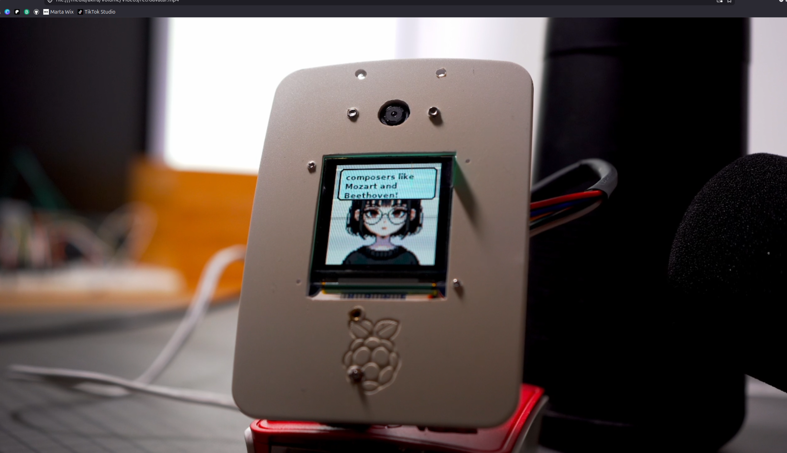

# 🤖 Retro Avatar: Offline-Ready Multimodal AI Companion

An interactive, physical desktop companion powered by a Raspberry Pi, a local workstation GPU running **Gemma 4 (12B)** via Ollama, a Seeeduino Xiao microcontroller, a camera, and an SPI color OLED display.

This project is a hybrid local/edge system: your Pi acts as the low-latency hardware gateway (handling real-time eye-gaze tracking, physical sensors, audio recording, and offline speech-to-text), while your PC’s GPU handles heavy multimodal reasoning and tool execution.

<p align="center">
  
</p>

---

## 📺 System Capabilities

* **Gaze-Activated Wakefulness**: Uses eye tracking (`haarcascade_eye_tree_eyeglasses.xml`) inside a detected face region to ensure the avatar only wakes up when you are looking directly at it.
* **Offline Background Wake-Word Detection**: Streams raw microphone data continuously from the Seeeduino Xiao and uses a local, lightweight **Vosk** engine to listen for trigger phrases (like *"hey avatar"*, *"hello"*, or *"computer"*). Typing, mouse clicks, and ambient noise are digitally filtered out.
* **Continuous Viewfinder Interface**: The camera feed stays active on the OLED screen during the local transcription phase, displaying red borders and a `"PROCESSING..."` text overlay to eliminate visual gaps.
* **Dynamic Multimodal Visual Capture**: If you ask a vision-related question (e.g., *"can you tell what this is?"*), the OLED screen displays a yellow-bordered `"HOLD STILL!"` viewfinder. It then flashes the screen white (simulating a camera shutter), snaps a photo, converts the colors to RGB, and forwards it to the LLM.
* **Modular MCP Tools (`mcp_tools/`)**: Exposes native python capabilities to the LLM:
  * **`mcp_tools/sensors.py`**: Reads real-time hardware vectors (tilt, rotational spin, and room noise) from your Xiao microcontroller.
  * **`mcp_tools/internet.py`**: Queries real-time weather forecasts via `wttr.in` and queries Wikipedia plain-text summaries without requiring any paid API keys.
  * **`mcp_tools/portrait.py`**: Captures your camera image, processes it locally using a Floyd-Steinberg ditherer mapped to a classic 1989 GameBoy 2-color palette, and overlays it under your speaking bubble.
* **Fault-Tolerant Fallbacks**: On boot, the system runs diagnostics. If a component (such as the camera or microcontroller) is missing, it displays a checklist on-screen and switches to fallback modes (like standard Linux `arecord` for standard USB/AUX headsets, or face-only activation) instead of crashing.

---

## 🔌 Hardware Connections & Pinout

### 1. Waveshare 1.5-inch RGB OLED (SSD1351)
Connect the OLED display directly to the Raspberry Pi's GPIO header using the standard SPI interface:

| OLED Pin | Cable Color (Waveshare) | Raspberry Pi Pin | GPIO Number | Purpose |
| :--- | :--- | :--- | :--- | :--- |
| **VCC** | Red | Pin 17 (or 1) | 3.3V | Power Supply (3.3V) |
| **GND** | Black | Pin 25 (or 9) | GND | Ground |
| **DIN** | Blue | Pin 19 | GPIO 10 (MOSI) | SPI Data Out |
| **CLK** | Yellow | Pin 23 | GPIO 11 (SCLK) | SPI Clock |
| **CS** | Orange | Pin 24 | GPIO 8 (CE0) | SPI Chip Enable |
| **DC** | Green | Pin 22 | GPIO 25 | Data/Command Control |
| **RST** | White | Pin 13 | GPIO 27 | Hardware Reset |

### 2. Seeeduino Xiao Microcontroller
Plug the Seeeduino Xiao directly into any of the Raspberry Pi's USB ports using a standard USB-C data cable.
* **Port**: Automatically resolves to `/dev/ttyACM0` (or falls back gracefully).
* **Audio**: Feeds raw 16kHz 16-bit Mono audio packets directly to the Pi's STT pipeline.
* **IMU**: Transmits raw accelerometer and gyroscope vectors for physical tool-calling.

### 3. Pi Camera & Speakers
* **Camera**: Connect your camera module ribbon cable directly to the Pi's camera port.
* **Audio Output**: Plug your speaker (e.g., Bose Revolve) into a Pi USB port, or plug any standard speaker/headset into the Pi's **3.5mm AUX analog headphone jack**.

### 💡 Hardware Backstory: Why the Seeeduino Xiao?

You might notice that using a full 32-bit microcontroller (the Seeeduino Xiao) as a microphone seems a bit overpowered! 

This choice started simply because it was the only microphone on hand during development. However, it quickly became a major engineering win:
* **Unified Connection**: Instead of running separate cables for a USB microphone, an accelerometer, and a gyroscope, the Xiao packages both raw 16kHz digital audio and 6-axis motion data into a single USB-C serial line.
* **CPU Offloading**: The Xiao handles the high-frequency sensor polling in the background, keeping the Pi's CPU completely free to focus on image rendering and offline speech-to-text.

---

## 📦 Step-by-Step Installation Guide

### 1. System Dependencies
Run this command in your Raspberry Pi's terminal to install the native Linux sound libraries, image utilities, and virtual environment manager:

```bash
sudo apt update && sudo apt upgrade -y
sudo apt install -y git python3-pip python3-venv alsa-utils libasound2-dev libopenjp2-7 libatlas-base-dev
```

### 2. Python Virtual Environment Setup
To prevent PEP 668 environment errors, we install our packages inside a virtual environment. We configure it with `--system-site-packages` so Python can access the Pi's global `picamera2` system drivers:

```bash
# Clone the repository
git clone https://github.com/yourusername/retroavatar.git
cd $HOME/retroavatar

# Create the virtual environment using global camera bindings
python3 -m venv --system-site-packages .

# Activate the virtual environment
source bin/activate

# Install the Python requirements
pip install -r requirements.txt
```

---

## 🗄️ Model Downloads

The avatar requires two local model files to run offline: **Vosk** (for Speech-to-Text) and **Piper** (for Text-to-Speech).

### 1. Download Vosk Speech-to-Text Model (40MB)
Run these commands inside your Pi's `~/retroavatar` directory:
```bash
cd $HOME/retroavatar
wget https://alphacephei.com/vosk/models/vosk-model-small-en-us-0.15.zip
unzip vosk-model-small-en-us-0.15.zip
mv vosk-model-small-en-us-0.15 vosk-model
rm vosk-model-small-en-us-0.15.zip
```

### 2. Download OpenCV Eye-Gaze Classifier
Download the eyeglasses-friendly Haar cascade model for eye-gaze tracking:
```bash
curl -L "https://raw.githubusercontent.com/opencv/opencv/master/data/haarcascades/haarcascade_eye_tree_eyeglasses.xml" -o $HOME/retroavatar/haarcascade_eye_tree_eyeglasses.xml
```

### 3. Set Up Piper Text-to-Speech (TTS)
Download the Piper TTS engine binary and the default low-latency voice model:
```bash
mkdir -p $HOME/piper && cd $HOME/piper
# Download the Piper binary package (ARMv7 for 32-bit Pi OS, or change to aarch64 if on 64-bit Pi OS)
wget https://github.com/rhasspy/piper/releases/download/v1.2.0/piper_armv7.tar.gz
tar -xf piper_armv7.tar.gz

# Download the low-latency voice model
wget https://github.com/rhasspy/piper/releases/download/v1.0.0/en_US-amy-low.onnx -O $HOME/piper/en_US-amy-low.onnx
```

---

## ⚙️ Configuration (`.env`)

Create a configuration file called `.env` in the root of your project directory (`~/retroavatar/.env`) to customize your hardware ports and AI backends:

```ini
# --- AI BACKEND ROUTING ---
# Options: "OLLAMA" (Local Workstation GPU) or "GEMINI" (Google Cloud)
SOURCE_MODEL=OLLAMA

# OLLAMA CONFIGURATION (Required only if SOURCE_MODEL=OLLAMA)
# Point OLLAMA_HOST to your local PC's local IP address on the network
OLLAMA_HOST=http://your_ip_address:11434
OLLAMA_MODEL=gemma4:12b

# GEMINI CONFIGURATION (Required only if SOURCE_MODEL=GEMINI)
GEMINI_API_KEY=your_google_gemini_api_key_here

# --- MICROCONTROLLER SETTINGS ---
SERIAL_PORT=/dev/ttyACM0
SERIAL_BAUD=2000000

# --- AUDIO PLAYBACK DEVICE ---
# Bose USB Speaker: "plughw:CARD=SoundLink,DEV=0"
# Default Headphone AUX Jack or HDMI: "default"
AUDIO_DEVICE=default
```

### How to Switch to Google Gemini (Cloud)
To bypass your local PC and use Google's cloud API for text, audio, and image generation:
1. Open your `.env` file.
2. Change `SOURCE_MODEL=GEMINI`.
3. Add your Gemini API Key in `GEMINI_API_KEY=AIzaSy...`.
4. Restart the service.

---

## 🖥️ Systemd Background Service (Run on Boot)

To make the avatar run automatically as a background system daemon when the Pi boots up:

1. Create a service file:
   ```bash
   sudo nano /etc/systemd/system/avatar.service
   ```
2. Paste the following configuration. **Make sure to replace `<YOUR_USERNAME>` with your actual Raspberry Pi username:**
   ```ini
   [Unit]
   Description=The Living Avatar Service
   After=network-online.target
   Wants=network-online.target

   [Service]
   User=root
   # NOTE: Replace <YOUR_USERNAME> with your actual Pi username (e.g., pi, admin)
   WorkingDirectory=/home/<YOUR_USERNAME>/retroavatar
   # Points directly to your virtual environment's python interpreter
   ExecStart=/home/<YOUR_USERNAME>/retroavatar/bin/python3 /home/<YOUR_USERNAME>/retroavatar/the_living_avatar.py
   Restart=always
   RestartSec=5

   [Install]
   WantedBy=multi-user.target
   ```
3. Enable and start the service:
   ```bash
   sudo systemctl daemon-reload
   sudo systemctl enable avatar.service
   sudo systemctl start avatar.service
   ```
4. Monitor the live terminal logs and STT outputs in real-time:
   ```bash
   sudo journalctl -u avatar.service -f
   ```

---

## ⚙️ Modular Tools Package (`mcp_tools/`)

All LLM capabilities are located inside the `mcp_tools/` folder. Gemma 4 evaluates these modules on demand:

* **`mcp_tools/sensors.py`**: Decoupled reader that formats your live Xiao microcontroller data (tilt, spin, room noise) into JSON.
* **`mcp_tools/internet.py`**: Web scraper tools including `get_current_weather(location)` (fetches plain-text from `wttr.in` using a terminal-simulated `curl` user-agent) and `search_wikipedia(query)` (Wikipedia search and clean summary parse).
* **`mcp_tools/portrait.py`**: Converts a captured PIL image into a dithered, 32-color, 1989 GameBoy Green classic retro portrait and displays it under your speaking bubble.
